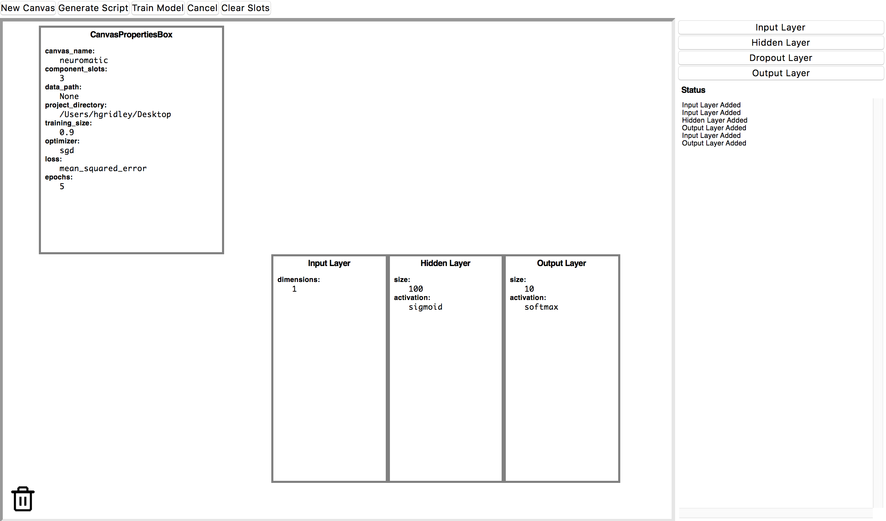

# Neuromatic

Neural network visualization and prototyping tool built using Keras and TKinter.



## Setup
### For Unix Distributions Only
If running Neuromatic for the first time, all that is required is the installation of Python 3.6 and pip3. To set up your environment run `python3 setup.py install` to install all dependencies and modules. If an error occurs, run `pip3 install --upgrade tensorflow` followed by `python3 setup.py install`. To run the program run `python3 Neuromatic.py` in the main folder. 

### Usage
```bash
cd /path/to/neuromatic

python -m interface.window
```

### Data
A CSV formatted version of the MNIST dataset is included with this project under `neuromatic/files/mnist.csv.zip`. 

### Examples
These are two baseline networks manually built using Keras and TensorFlow. Running the scripts trains them on the MNIST dataset and displays their accuracy.

```bash
python -m examples.keras_baseline
python -m examples.tf_baseline
```

### Integration Test
Test to show end-to-end script generation and model training.
```bash
python -m tests.end_to_end
```
