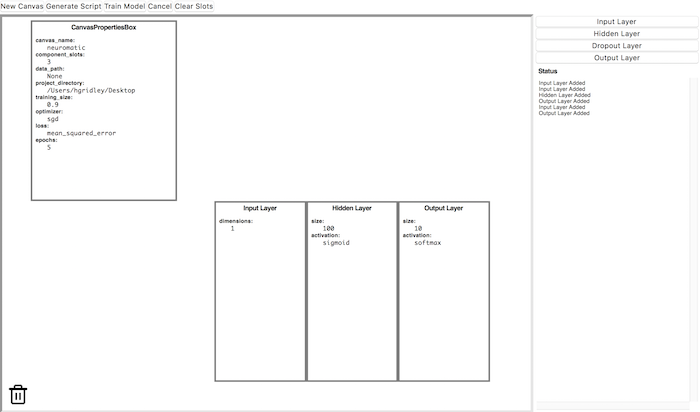

# Neuromatic

Neural network visualization and prototyping tool built using Keras and TKinter.

The goal of this project was to create a tool that would allow developers to design and build neural networks without needing years of machine learning or coding experience. A user should be able to take a neural network like the one pictured below and convert it into code using a GUI.


## Setup
### For Unix Distributions Only
If running Neuromatic for the first time, all that is required is the installation of Python 3.6 and pip3. To set up your environment, via a command prompt run `python3 setup.py install` to install all dependencies and modules. If an error occurs, run `pip3 install --upgrade tensorflow` followed by `python3 setup.py install`. To run the program run `python3 Neuromatic.py` in the folder. 

### Usage



```bash
cd /path/to/neuromatic

python3 Neuromatic.py
```

### Data
A CSV formatted version of the MNIST dataset (example shown below) is included with this project under `neuromatic/files/mnist.csv.zip`. All data must be pre-processed to match the csv format. 


### Examples
These are two baseline networks manually built using Keras and TensorFlow. Running the scripts trains them on the MNIST dataset and displays their accuracy.

```bash
python -m examples.keras_baseline
python -m examples.tf_baseline
```

After building a network, you can test it on some custom hand-written numbers by running
```bash
python -m examples.number_prediction
```
